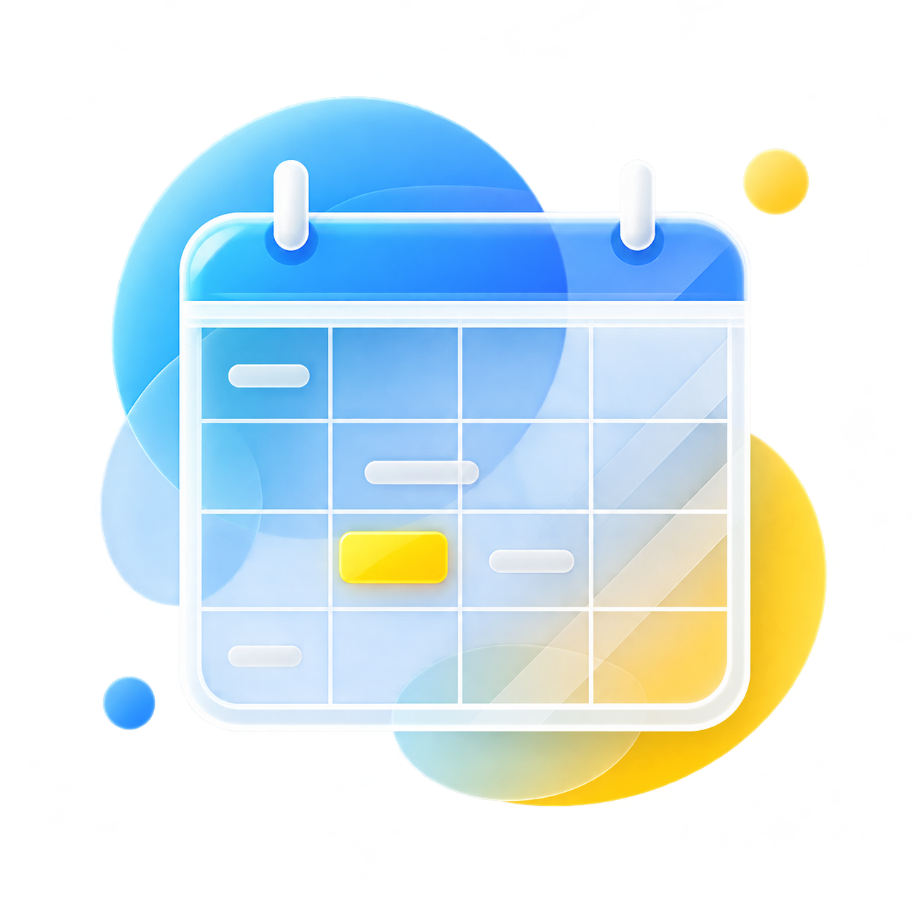
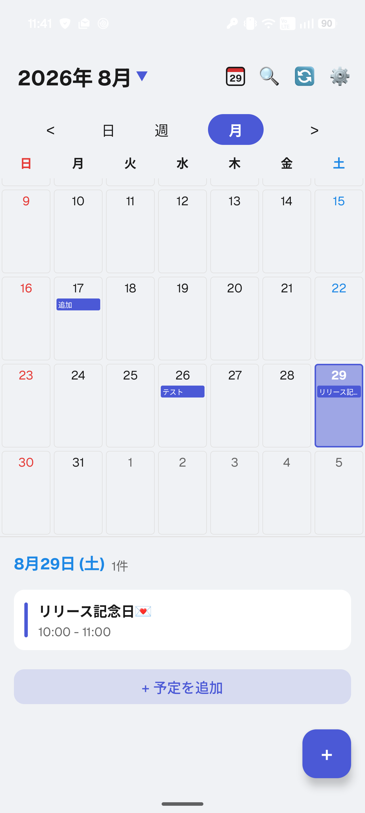
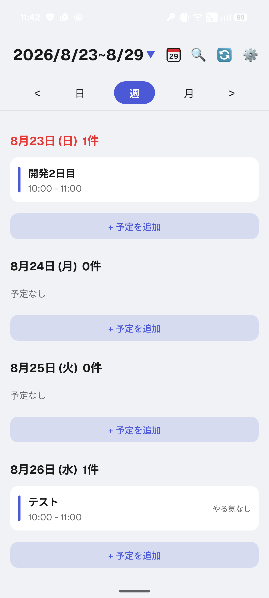
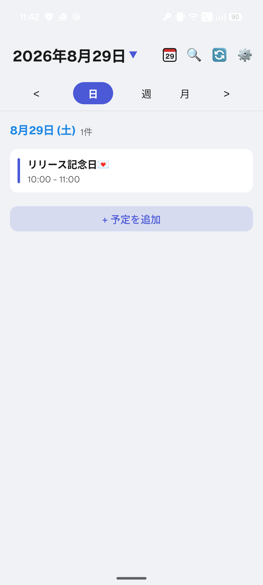
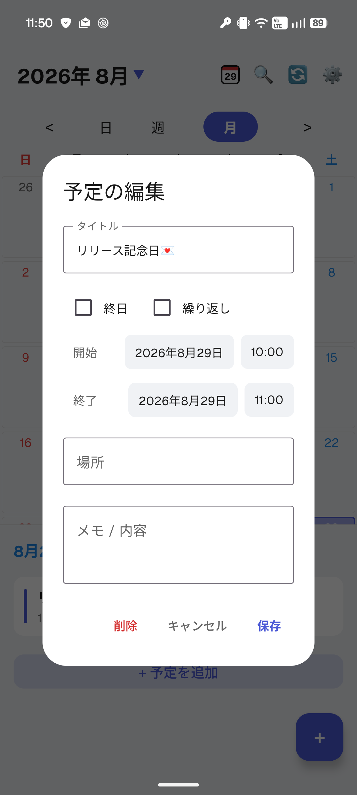
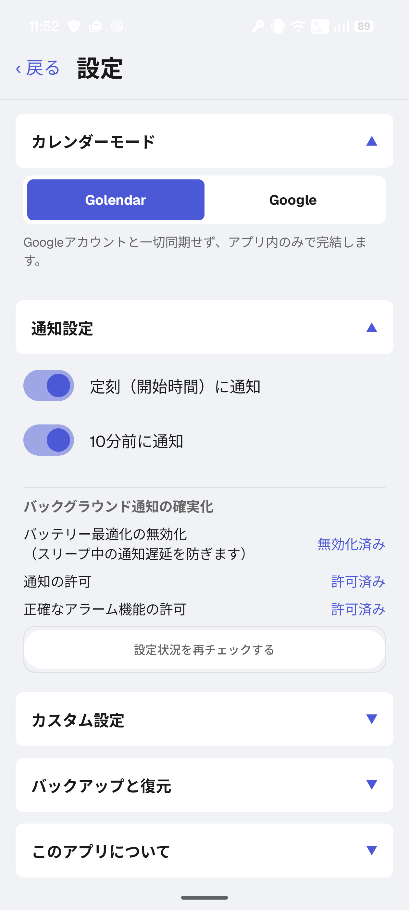
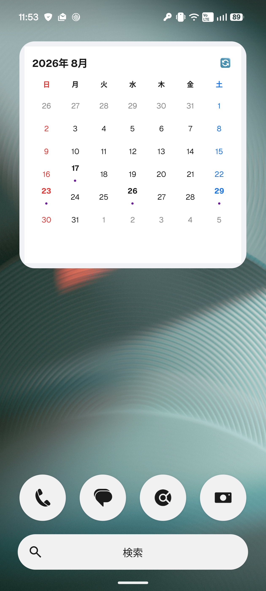
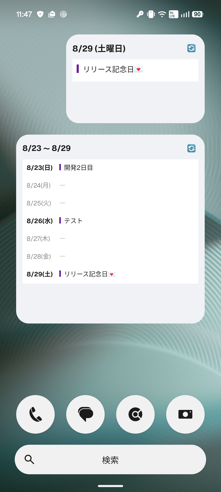

  

# 📅 Golendar

**Golendar** は、シンプルで使いやすい月・週・日表示を備えた Android カレンダーアプリです。  
プライバシーに配慮した「ローカル専用モード」と、利便性の高い「Googleカレンダー同期モード」の2つを搭載し、用途に合わせて切り替えて使用できます。

---

## 📲 ダウンロード

最新のAPKは [GitHub Releases](https://github.com/monsivamon/Golendar/releases/latest) からダウンロードできます。

> **📌 インストール方法**  
> ダウンロードしたAPKファイルを端末で開き、「不明なアプリのインストール」を許可してインストールしてください。  
> （Android 8.0以降では、設定 > セキュリティ > 不明なアプリのインストール から許可が必要な場合があります）

---

## 📸 スクリーンショット

### カレンダービュー

| 月間カレンダー | 週間カレンダー | 日間カレンダー |
|:-:|:-:|:-:|
|  |  |  |

---

### 予定編集・設定

| 予定の追加／編集 | 設定画面（カスタマイズ） |
|:-:|:-:|
|  |  |

---

### ホーム画面ウィジェット

| 月間ウィジェット | 日次・週次ウィジェット |
|:-:|:-:|
|  |  |

---

## ✨ 主な機能

- **デュアルエンジン搭載**
  - **Golendarモード**：デバイス内部（ローカル）でのみ予定を管理。外部サーバーと通信しないため、完全にプライベートな予定の管理に最適です。
  - **Googleモード**：GoogleカレンダーのAPIと同期し、他のデバイスやサービスと予定を共有できます。

- **柔軟なカレンダービュー**
  - 月間・週間・日間の3つのビューをシームレスに切り替え可能。
  - 繰り返し予定（毎週・毎月など）の表示・編集にも対応。

- **カスタマイズ可能なホーム画面ウィジェット**
  - 日間・週間・月間の3種類を提供。
  - アプリ内の設定と連動し、16色のパステルカラーで背景を自由にカスタマイズ可能。

- **正確なリマインダー通知**
  - 「定刻（開始時間）」および「10分前」の通知をサポート。
  - AndroidのDoze（省電力機能）対策として `AlarmManager` の正確なアラーム機能を使用し、端末再起動時にも自動で再スケジュールします。

- **強力なデータバックアップ＆復元**
  - ローカル予定とアプリ設定（テーマ・曜日の色・週の始まりなど）を JSON ファイルとしてエクスポート可能。
  - Googleカレンダーの予定をバックアップし、Golendarモードや別のアカウントへ「追記」することで、予定の移行・統合が簡単に行えます。

- **日本の祝日・文化イベントの自動識別**
  - 外部APIから日本の祝日を自動取得し、カレンダーに表示。
  - 祝日・文化イベント（七夕・バレンタインなど）・誕生日を自動判別し、それぞれ異なる色で表示します。

---

## 🎨 カスタマイズとデザイン

- **表示テーマ**：ライトモード / ダークモード / システム追従
- **背景カラー**：16種類のパステルカラーから選択（ウィジェットにも連動）
- **曜日の色付け**：すべての曜日に自由にカラーを設定可能
- **イベントの色分け表示**：誕生日はオレンジ、文化イベントは緑、通常予定はテーマカラーで自動判別
- **週の始まり**：日曜日 / 月曜日 を選択可能

---

## 🛠 使用技術

| カテゴリ | 技術 |
|----------|------|
| 言語 | Kotlin |
| UI フレームワーク | Jetpack Compose |
| ウィジェット | Jetpack Glance |
| ローカルデータベース | Room |
| 設定の保存 | Preferences DataStore |
| バックグラウンド処理 | Coroutines, AlarmManager, BroadcastReceiver |
| アーキテクチャ | MVVM (Model-View-ViewModel) |

---

## ⚠️ 既知の仕様・注意点

- **カレンダー権限について**  
  Googleカレンダーモードを利用するには、端末の設定からカレンダーへのアクセス権限（`READ_CALENDAR` / `WRITE_CALENDAR`）を許可する必要があります。  
  権限が付与されていない状態でGoogleモードを選択しようとすると、権限リクエストダイアログが表示され、拒否した場合は自動的にGolendarモードに切り替わります。

- **通知機能について**  
  確実な通知を受け取るために、**アプリの通知許可**を有効にし、設定画面から「バッテリー最適化の無効化」および「正確なアラーム機能の許可」を行ってください。  
  一部のメーカー（Xiaomi, OPPO 等）の端末では、OS独自のタスクキルにより通知が遅延する場合があります。

- **祝日データについて**  
  日本の祝日データは `holidays-jp.github.io` から取得しています。そのため、インターネット接続が必要です（初回起動時および30日ごとに自動更新されます）。オフライン時は最後に取得したデータを表示します。

- **復元機能について**  
  データの誤消失を防ぐため、Googleモード選択時は JSON ファイルからの「復元（上書き）」がブロックされ、「追記」のみが許可される安全設計となっています。

---

## 📄 ライセンス

このプロジェクトは [GNU General Public License v3.0 (GPLv3)](LICENSE) のもとで公開されています。