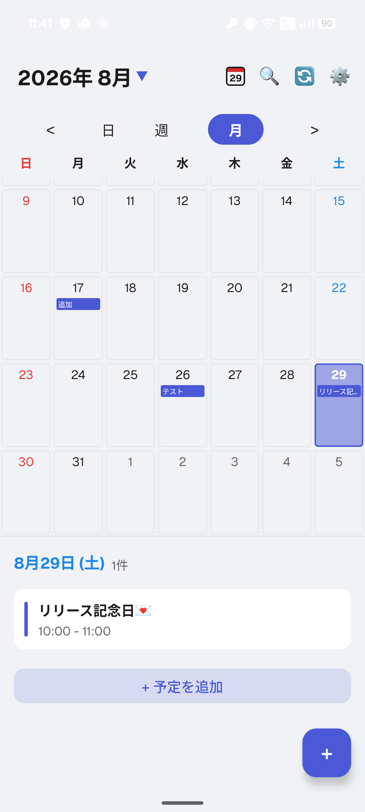
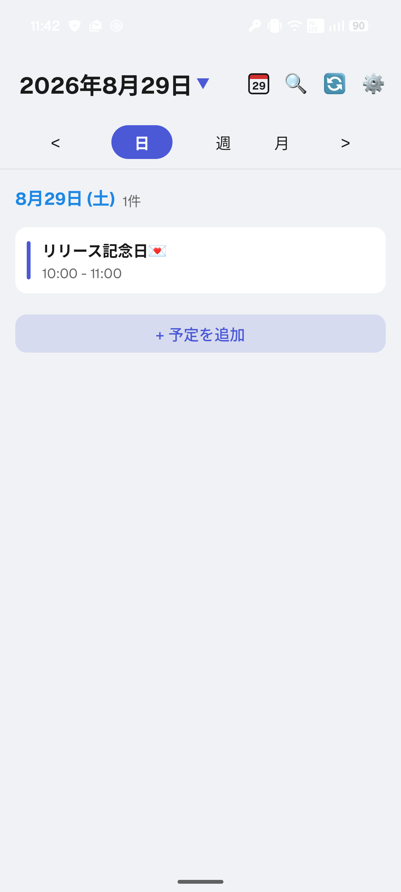
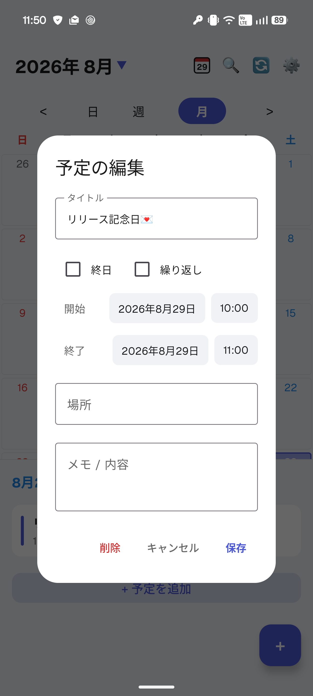
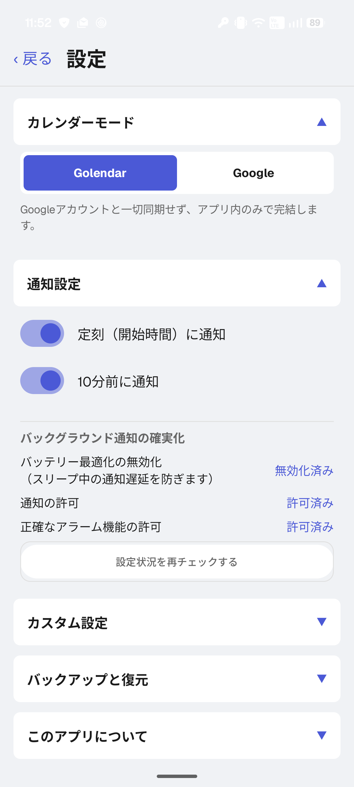
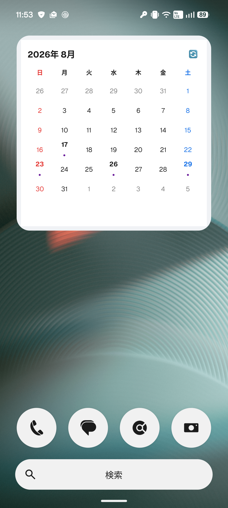

  

  <strong>Your idea, your future.</strong>

# 📅 Golendar

月・週・日表示を備えた Android カレンダーアプリ。
プライバシー重視の **Golendarモード**（アプリ内完結）と、**Googleモード**（Googleカレンダー同期）の2つを搭載。

---

## 📲 ダウンロード

最新のAPKは [GitHub Releases](https://github.com/monsivamon/Golendar/releases/latest) から。
APKを端末で開き、「不明なアプリのインストール」を許可してインストール。

---

## 📸 スクリーンショット

| 月間 | 週間 | 日間 |
|:-:|:-:|:-:|
|  |  |  |

| 予定編集 | 設定 | ウィジェット |
|:-:|:-:|:-:|
|  |  |  |

---

## ✨ 主な機能

### デュアルエンジン
- **Golendarモード**：外部同期なし。アプリ内のみで完結（祝日取得・地図表示のみネット使用）。
- **Googleモード**：Googleカレンダーと同期。

### Googleカレンダーの複数カレンダー対応
- アカウント単位でカレンダーを一覧表示し、表示するものを選択。
- 設定画面で個別に表示 ON/OFF、色のカスタマイズが可能。
- 表示カレンダーが2つ以上のとき、予定カードにカレンダー名と色を表示。
- 「カレンダー一覧を再取得」で追加・削除に追従。

### カレンダービュー
- 月・週・日ビューをシームレスに切替。
- 月グリッド下の予定リストは ON/OFF 切替可能（下部リスト OFF 時は日付タップでポップアップ）。
- 予定検索（過去2年〜未来2年、祝日・文化・誕生日は除外）。
- 上下スワイプで前後の期間、左右スワイプで日・週・月タブ切替。
- 予定カードに種別絵文字（🎂 誕生日 / 🎌 文化 / 🗾 祝日）。

### 地図で場所を選択
- MapLibre Native + OpenFreeMap の地図から選択。
- 現在地追従ボタン付き。「POI名, 住所」形式で保存。

### 繰り返し予定
- 毎日 / 平日 / 毎週 / 毎月 / 毎年。終了日指定可。

### 予定の共有
- 詳細ダイアログからテキストとして他アプリへ共有。

### 写真の添付（Golendarモード専用）
- 予定に最大5枚添付。長辺1920pxに自動縮小。
- 拡大ビューア・端末の「ピクチャ/Golendar」への書出し対応。

### AI解析による予定一括登録（BETA・Golendarモード専用）
- カレンダー画像を外部AIに読み取らせ、返却JSONから予定を一括登録。
- プロンプトのコピー／共有シート対応。プレビューで選択して登録。

### アプリショートカット
- アイコン長押しで「予定追加」「今日」「検索」。

### ホーム画面ウィジェット
- 日間・週間・月間の3種類。アプリ設定（テーマ・背景色・表示カレンダー）と連動。
- 月間ウィジェットは前後月セルも含めて予定ドットを表示。

### リマインダー通知
- 定刻・10分前の通知。`AlarmManager` の正確なアラームで Doze 対策。
- 祝日・文化イベントは通知対象外。**誕生日は通知対象**（天皇誕生日は祝日扱いで除外）。
- 表示カレンダー設定と連動。

### 初回起動時のセットアップ
1. 通知の許可（通知 → 正確なアラーム → バッテリー最適化の無効化）
2. Google カレンダーへのアクセス許可
3. 表示するカレンダーの選択（Googleモード時）
4. ジェスチャー操作の案内

位置情報は初めて地図を開いたときに案内。

### バックアップ＆復元
- 予定と設定を JSON で保存。「写真もバックアップ」ON 時は ZIP（Golendarモードのみ）。
- Googleモードでの「追記」時は復元先カレンダーを選択可能。
- 祝日データは含まれず、復元時に自動再取得。

### 祝日・文化イベント
- `holidays-jp` API から自動取得（初回＋30日ごと）。
- 祝日・文化・誕生日を自動判別し、色と絵文字で表示。
- 設定画面で「祝日を表示」ON/OFF 切替可。

---

## 🎨 カスタマイズ

- テーマ：ライト / ダーク / システム追従
- アプリ背景色：16色のパステルカラー（カレンダー・設定・ウィジェット連動）
- 曜日の色：全曜日に設定可
- カレンダーごとの色：Googleモードで個別設定
- イベント色分け：誕生日=オレンジ、文化=緑、通常=テーマカラー（カレンダー色優先）
- 週の始まり：日曜 / 月曜
- 祝日表示：ON/OFF

---

## 🛠 使用技術

| カテゴリ | 技術 |
|---|---|
| 言語 | Kotlin |
| UI | Jetpack Compose |
| ナビゲーション | Navigation Compose |
| ウィジェット | Jetpack Glance |
| ローカルDB | Room |
| 設定 | Preferences DataStore |
| バックグラウンド | Coroutines, AlarmManager, WorkManager |
| 地図 | MapLibre Native GL（OpenFreeMap） |
| 逆ジオコーディング | Nominatim, 国土地理院 |
| 画像読込 | Coil |
| アーキテクチャ | MVVM |

---

## ⚠️ 注意点

- **カレンダー権限**：Googleモード時は `READ_CALENDAR` / `WRITE_CALENDAR` が必要。拒否時は自動で Golendar モードへ。Google アカウントが無い場合は切替時に案内表示。
- **表示カレンダー**：1つも選択していない状態では、予定・ウィジェット・通知すべて表示されない。カレンダー追加・削除後は「カレンダー一覧を再取得」を実行。
- **通知**：バッテリー最適化の無効化と正確なアラームの許可を推奨。一部メーカー端末では遅延あり。
- **地図**：要ネット接続。位置情報を拒否しても地図機能は使える。
- **検索**：祝日・文化・誕生日は除外。
- **繰り返し**：「終了」は1回分の所要時間。全体の終了日は別途指定。
- **祝日データ**：オフライン時は最後に取得したデータを表示。
- **バックアップ**：Googleモードでは「復元（上書き）」不可、「追記」のみ可。
- **写真添付**：Golendarモード専用。クラウド自動バックアップからは除外。
- **AI解析**：Golendarモード専用。解析結果はローカルDBのみ反映。

---

## 🙏 Credits

### データ・API
- 祝日データ：[holidays-jp](https://github.com/holidays-jp/date.json)（MIT）
- 地図データ：[OpenStreetMap](https://www.openstreetmap.org/) contributors（ODbL）
- タイル配信：[OpenFreeMap](https://openfreemap.org/)
- 逆ジオコーディング：[Nominatim](https://nominatim.org/) / [国土地理院](https://mreversegeocoder.gsi.go.jp/)

### ライブラリ
- MapLibre Native for Android（BSD-2-Clause）
- AndroidX / Jetpack（Apache 2.0）
- Kotlin（Apache 2.0）
- Coil（Apache 2.0）

### アセット
- Android robot：Google 作成（CC BY 3.0）

---

## 📄 ライセンス

[GNU General Public License v3.0 (GPLv3)](LICENSE)

### サードパーティライセンス

| 名称 | ライセンス |
|---|---|
| Kotlin, AndroidX, Jetpack Compose, Room, DataStore, Glance, WorkManager | Apache 2.0 |
| Coil | Apache 2.0 |
| MapLibre Native for Android | BSD-2-Clause |
| OpenStreetMap データ | ODbL 1.0 |
| Nominatim | GPL v2（サービス利用） |
| holidays-jp | MIT |